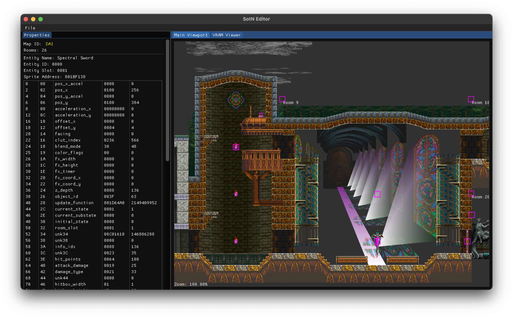

# SotN Editor

SotN Editor is a mod tool for Castlevania: Symphony of the Night.

It is currently only capable of parsing and displaying data contained within map files (`ST/*/*.BIN` and `BOSS/*/*.BIN`), but it will eventually be able to modify map data (entities, tiles, rooms, etc.) and export those changes back into a working ROM file.



|Platform|Status|Download|
|--------|------|--------|
|Windows|[](https://github.com/KernelEquinox/SotN-Editor/actions/workflows/Windows.yml)|[Windows 64-bit (x86)](https://github.com/KernelEquinox/SotN-Editor/releases/latest/download/SotN_Editor_Windows.zip)|
|Linux|[](https://github.com/KernelEquinox/SotN-Editor/actions/workflows/Linux.yml)|[Linux 64-bit (x86)](https://github.com/KernelEquinox/SotN-Editor/releases/latest/download/SotN_Editor_Linux.zip)|
|macOS|[](https://github.com/KernelEquinox/SotN-Editor/actions/workflows/macOS.yml)|[macOS](https://github.com/KernelEquinox/SotN-Editor/releases/latest/download/SotN_Editor_macOS.zip)|


## Usage

When loading for the first time, SotN Editor will ask for the locations of the PSX binary (`SLUS000.67`), the SotN binary (`DRA.BIN`), and the common graphics file (`BIN/F_GAME.BIN`).

To load a map file, click on `File` -> `Open Map File`, then select one of the map files in the `ST/` or `BOSS/` directory (e.g. `ST/ARE/ARE.BIN`).

Once the map is loaded, the map can be navigated by either clicking and dragging or by using the scroll wheel or touchpad to pan around the map. Clicking on an entity will display the entity's properties in the left-hand Properties window.

The `+` and `-` keys can be used to zoom in and out of the viewport.


## Building

### Linux

Install the necessary requirements by running the following command:

```
sudo apt install build-essential cmake libglfw3-dev libglew-dev libgtk-3-dev
```

Once the requirements are installed, the program can be built by running the following commands:

```
git clone --recursive https://github.com/KernelEquinox/SotN-Editor.git
cd SotN-Editor
cmake -B build
cmake --build build
```

This will create the program in the `build/` directory.

### macOS

Install the necessary requirements with `brew` by running the following command:

```
brew install glew glfw
```

Alternatively, the requirements can be installed via `conda` by running the following command:

```
conda install glew glfw
```

Once the requirements are installed, the program can be built by running the following commands:

```
git clone --recursive https://github.com/KernelEquinox/SotN-Editor.git
cd SotN-Editor
cmake -B build
cmake --build build
```

This will create the program in the `build/` directory.

### Windows

To build the program on Windows:

1. Install [Visual Studio 2022 Community Edition](https://visualstudio.microsoft.com/thank-you-downloading-visual-studio/?sku=Community) and ensure that `Desktop development with C++` is selected in the Workloads tab.
2. Install [Git for Windows](https://git-scm.com/download/win).
3. Run the following command:

   ```
   git clone --recursive https://github.com/KernelEquinox/SotN-Editor.git
   ```
   
4. Double-click on the `build.bat` file to build the project.

This will create the program in the `build/Debug/` directory.


## Known Issues

<details>
  <summary>List of issues</summary>
   
* Sprites for the Venus Weed family of enemies only display one half of the sprite.
* Hellfire Beast's hands for the lightning animation are shown.
* Blue doors don't show up.
* Segmented enemies (e.g. Hammer, Blade, Gurkha, Plate Lord) don't have subsprites attached correctly.
* The charge sprite for the Nova Skeleton's beam is always shown. It looks bad.
* Azaghal's sword is shown twice. Not a bug, it's just ugly.
* Some areas only show water for the first square of larger rooms. This is normal and expected, but it doesn't look good.
* DAI: Opening another map before opening DAI causes the chapel's ceiling arches to discolor.
* DAI: Overlap on room 13 and room 1.
* DAI: Overlap on room 13 and room 2.
* DAI: Overlap on room 13 and room 6.
* DAI: Overlap on room 13 and room 7.
* DAI: Overlap on room 13 and room 10.
* DAI: Overlap on room 14 and room 2.
* DAI: Overlap on room 14 and room 3.
* DAI: Overlap on room 17 and room 5.
* DAI: Overlap on room 17 and room 15.
* DAI: Overlap on room 17 and room 16.
* LIB: Some stray black boxes are shown and aren't correctly placed.
* LIB: The background of the area in room 9 near the Ectoplasm enemies isn't tiled.
* NO0: Certain candles in certain rooms don't appear for some reason.
* NO0: The statues and clock parts in room 9 aren't shadowed correctly. Some of sprites should have `BlendMode_Dark` applied to them, but doing so causes other sprites in other maps to have incorrect shading applied.
* NO0: Stone Rose does not appear.
* NO2: Polygons have incorrect textures applied at the top-left of room 8.
* NO3: The large door at the castle entrance is repeated directly underneath its normal position.
* NO3: Water parts are separated oddly.
* NO3: An extra chain part is displayed in front of the large stone near the top of room 15.
* NO4: Waterfall texture does not extend all the way down in room 26. (Possibly intentional?)
* NO4: Pulleys to lift the boat are not displayed in room 25.
* NP3: The large door at the castle entrance is repeated directly underneath its normal position.
* NP3: Water parts are separated oddly.
* NP3: Slogra does not show up alongside Gaibon.
* NZ0: Cannon is flipped the wrong way in room 4.
* NZ1: Overlap on room 1 and room 3.
* NZ1: Overlap on room 6 and room 9.
* RDAI: Overlap on room 13 and room 1.
* RDAI: Overlap on room 13 and room 2.
* RDAI: Overlap on room 13 and room 6.
* RDAI: Overlap on room 13 and room 7.
* RDAI: Overlap on room 13 and room 10.
* RDAI: Overlap on room 14 and room 2.
* RDAI: Overlap on room 14 and room 3.
* RDAI: Overlap on room 17 and room 5.
* RDAI: Overlap on room 17 and room 15.
* RDAI: Overlap on room 17 and room 16.
* RDAI: Back of room 9 is colored cyan and should have windows flipped vertically. One of the ceiling arches isn't properly placed.
* RDAI: Candle located in room 11 at (635, 1748), which is slightly outside the playable area. Not a bug, just a neat fact.
* RLIB: Some stray black boxes are shown and aren't correctly placed.
* RLIB: The background of the area located at the top-left of room 9 isn't tiled.
* RLIB: The desk in room 4 isn't flipped (rotated) properly. -- FIXED
* RNO0: Certain candles in certain rooms don't appear for some reason.
* RNO0: The statues and clock parts in room 9 aren't shadowed correctly. Some of sprites should have `BlendMode_Dark` applied to them, but doing so causes other sprites in other maps to have incorrect shading applied.
* RNO2: Polygons have incorrect textures applied at the top-left of room 8.
* RNO3: Candle located in room 12 at (184, 5772), which is far below the playable area. Not a bug, just a neat fact.
* RNO3: Water parts are separated oddly.
* RNO4: Waterfall texture does not extend all the way down in room 26. (Possibly intentional?)
* RNO4: Gradients for the waterfall mist display oddly in room 26.
* RNZ1: Overlap on room 1 and room 3.
* RNZ1: Overlap on room 6 and room 9.
* RTOP: Triangle polygon for the clock tower isn't rendered. This is included as a TODO in `main.cpp`.
* RWRP: Each room has a black square covering the warp keyhole.
* ST0: Breakable entities don't appear in room 1 or room 3.
* TOP: Triangle polygon for the clock tower isn't rendered. This is included as a TODO in `main.cpp`.
* WRP: Each room has a black square covering the warp keyhole.
* WRP: Rocks don't show up on the floors of the rooms.
* BO6: Richter isn't shown.
* BO7: Odd rotated texture in the background.
* MAR: The statues and clock parts aren't shadowed correctly. Some of sprites should have `BlendMode_Dark` applied to them, but doing so causes other sprites in other maps to have incorrect shading applied.
* RBO6: Dracula's larger left wing (viewer's right) isn't flipped correctly.
* RBO8: Galamoth.
   
</details>
